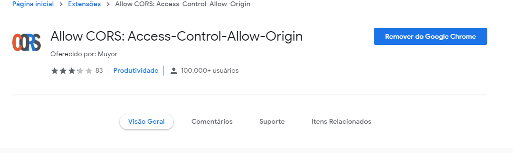

# Rispar-teste para Front end 

 [](https://app.fossa.com/projects/git%2Bgithub.com%2FFilhoSergio%2FRispar-Teste-Front-end?ref=badge_small)
 [](https://app.fossa.com/projects/git%2Bgithub.com%2FFilhoSergio%2FRispar-Teste-Front-end?ref=badge_shield)

## Pré Requisitos

Para Desabilitar o cors com Google CHROME utilizei essa extensão , já no Firefox não houve a necessidade.

 

Através do arquivo vue.config.js o proxy redireciona as consultas para serem realizadas da mesma origem .
```
module.exports = {
  devServer: {
    proxy: {
      "/proxy_api": {
        target: "url_para_consulta",
        pathRewrite: {
          "^/proxy_api": "/"
        }
      }
    }
  }
};

```

## Instalando Depêndencias do projeto
```
npm install
```

### Iniciar aplicação
```
npm run serve
```

### Compilar e minificar para modo de produção
```
npm run build
```


### Lints e fixes 
```
npm run lint
```


